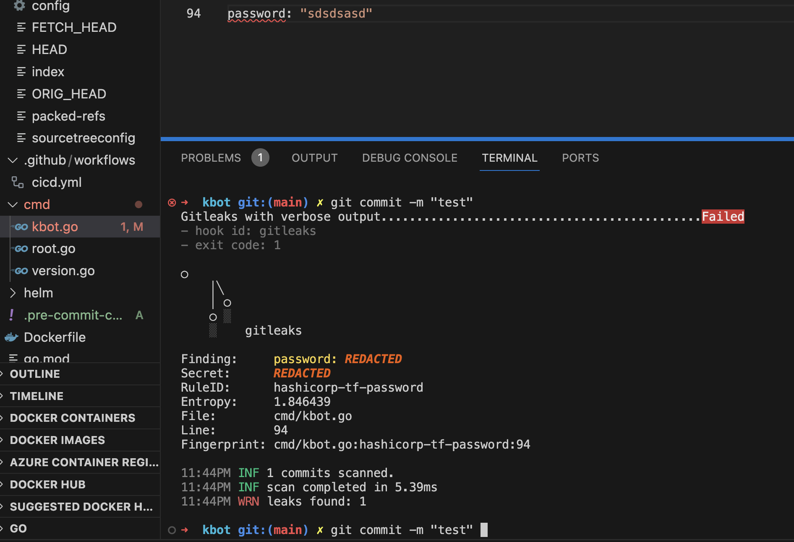

**Script for automatic code checking before pushing to a Git repository using gitleaks**

This script performs the following actions:

- Determines the current operating system (macOS, Windows, Linux).
- The script checks the availability of certain commands in the system by executing them with the --version parameter and checking the success of execution. If the command is available, the script continues; otherwise, it displays an error.
- Depending on the operating system, the script installs the necessary packages using different commands such as brew install, pip install, apt-get, or yum. After installation, the script reports the result: successful installation or an error.
- Creates a configuration for the pre-commit tool.
- Installs the pre-commit tools and automatically updates hooks.
- Checks if the gitleaks tool is enabled in Git settings and enables it if necessary.
- Install Python from the official website if it is not already installed: https://www.python.org/downloads/


**!! HowDon't forget that you must be in the project's git repository before executing the script.**

**Run executable script for MacOS/Unix**

```console
curl -o install_pre_commit.py https://raw.githubusercontent.com/cipgen/mod8_task1/main/install_pre_commit.py && chmod +x install_pre_commit.py && git config --local gitleaks.enable true && python install_pre_commit.py
```

**Run executable script for Windows**

```console
curl -o install_pre_commit.py https://raw.githubusercontent.com/cipgen/mod8_task1/main/install_pre_commit.py && git config --local gitleaks.enable true && python install_pre_commit.py
```
_____

**If you want to disable gitleaks checks, use the following command:**

```console
git config --local gitleaks.enable False
```

**Example of a check:**


